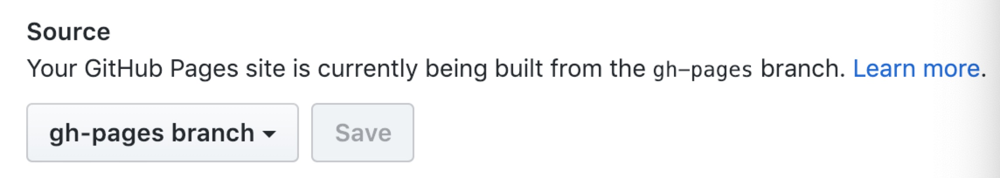

# 使用 `VuePress` + `Github Pages` 搭建博客

[[TOC]]

:::tip
准备讲讲怎么用 `VuePress` + `GitHub Pages` 搭一个最基本的博客
:::

## 2018年12月22日

### **前言**

其实很久之前就很想搭一个博客来记录自己平时学习的一些内容，但拖延症，懒等等因素（都没好意思说是没时间，想想我这几年到底浪费了多少时间在毫无意义的事情上），很多次都半途而废了，生活渐渐进入养老的模式……<br>
在一些机缘巧合窥到同事的博客，更新的频率和质量都让我眼前一亮。现在已经是12月底了，在渲染了好长一段时间的互联网寒冬还没过去的现在，好好学习天天向上还是蛮重要的。<br>
所以，开始写博客吧！每天一道 `LeetCode` 的题目，然后结合那个写博客。<br>
又或者，当学了什么新东西的时候，也写一写，赠强一下理解。<br>

开始搭建博客。<br>
以前我其实有搭建过一些自己的博客，在腾讯云上租了服务器，安装了 `LNMP` 的服务器软件镜像，又下了 Typecho 的框架，就直接开始写了。没过几天就停了……<br>
这其中有很大一部分原因是，懒。所以这一次的博客，一定要吸取之前的教训，**认真做，坚持做才行**。<br>


**使用 GitHub Pages 的优点在于——**
- `GitHub Pages` 有 300M 的免费空间（这对于绝大多数博客已经是够用的了，如果不够，未来再迁移到其他地方，相信那个时候你已经具备足够的技术支持了），资料自己管理，保存可靠
- 学习使用 `GitHub`，这个的重要性相信不需要笔者多说什么了吧？

**使用 VuePress** 则纯粹是笔者之前做分享会的时候用过一次这玩意，UI 设计上体验挺好的，使用 markdown 语言，所以对于程序员来说超级方便<br>

### **正文**

以下例子均以笔者的情况为例——<br>

使用 `VuePress` + `GitHub Pages` 搭建博客的先决条件是，你需要先注册一个 `github` 账号（这一步笔者就直接省略了，毕竟不是本文的重点），而后就是创建一个仓库（repository），这个 repository 的名称格式，最好是 `用户名.github.io`，当然你可以可以不这么做，笔者的就是设置为 `wubai-blog`。<br>

搭建完之后，选择 `Settings`，进入 `Settings` 后，往下可以找到 `GitHub Pages` 的设置界面。<br>
在 `Source` 那一栏里面可以设置选择哪一个分支来构建 `GitHub Pages`。这里其实看大家需要，一般来说都是使用 `master` ，会直接去读取该目录下的 `index.html` 和 `README.md` 文件。这里**暂时**我们把它设置为使用 `master` 分支来构建。**记得要点击随后紧跟着的 `Save` 按钮。<br>

然后你可以在下面的 `Choose a theme` 来选择一个你喜欢的主题（虽然对于笔者要使用的搭建博客的方式来说，选择主题并没有什么卵用）。选择完之后，回到 `Settings` 那一个板块，应该在 `GitHub Pages` 底下可以看到一行 `Your site is published at https://wubaigit.github.io/wubai-blog/`。点击链接，你就可以看到目前已经构建好的页面。<br>

然后是 `VuePress` 方面。<br>

首先要做的第一件事情是：拉取代码。<br>

在恰当的路径下，运行如下代码——<br>

``` bash
$ git clone https://github.com/wubaigit/wubai-blog.git
$ cd ./wubai-blog
$ yarn init -y
$ yarn add vuepress -D
```

然后在根目录下，创建一个文件夹叫 `blog`（当然叫啥都可以，只要你喜欢，官方推荐的名字叫 `docs`，因为我这个是给博客用的，所以我就起名叫 `blog` 了）。然后在底下创建一个叫 `.vuepress` 的文件夹，因为 `VuePress` *遵循“**约定优于配置**”*（官方博客原话），对于 `VuePress` 就是所谓的配置目录。官方的推荐目录结构为——

```
.
├── docs
│   ├── .vuepress (可选的)
│   │   ├── components (可选的)
│   │   ├── theme (可选的)
│   │   │   └── Layout.vue
│   │   ├── public (可选的)
│   │   ├── styles (可选的)
│   │   │   ├── index.styl
│   │   │   └── palette.styl
│   │   ├── templates (可选的, 谨慎配置)
│   │   │   ├── dev.html
│   │   │   └── ssr.html
│   │   ├── config.js (可选的)
│   │   └── enhanceApp.js (可选的)
│   │ 
│   ├── README.md
│   ├── guide
│   │   └── README.md
│   └── config.md
│ 
└── package.json

```

一步一步来，我们创建完 `./blog/.vuepress` 之后，在底下创建 `config.js` 文件。这个文件需要导出一个 `JavaScript` 对象。

```js
module.exports = {
  title: '我思故我在',
  base: '/wubai-blog/',
  themeConfig: {
    sidebar: [
      {
        title: '首页',
        children: [
          '/',
        ],
      },
    ],
    sidebarDepth: 0,
  },
};
```

而后，在 `./blog` 目录底下，新建一个 `README.md` 文件，对于 `VuePress` 来说，这就是一个 `index.html` 。写入——<br>
`# Hello World`<br>

接着编辑 `./package.json` 文件，添加 `scripts` 字段，例如：<br>
```json
{
  "scripts": {
    "dev": "vuepress dev blog",
    "build": "vuepress build blog"
  }
}
```

因为 `.vuepress` 所在的目录名叫 `blog`，所以 `vuepress dev` 的时候，对应的参数也应该是 `blog`，即 `vuepress dev blog`。当构建生产环境的时候（对于 `VuePress` 来说，就是生成静态文件），亦同。<br>

这时候，运行 `yarn dev` 应该可以在本地看到想要的效果。<br>

还没完，本文的主题是 **使用 `VuePress` + `Github Pages` 搭建博客** ，所以关于 `VuePress` 更详细的使用说明可以参照 `VuePress` 的官方文档。接下来说说部署，这一块，其实 [VuePress 官方部署方案](https://vuepress.vuejs.org/zh/guide/deploy.html) 也有说明，但是其中有一些模糊的地方。<br>

我们首先可以在根目录下新建一个脚本，叫 `deploy.sh`。<br>

``` bash
#!/usr/bin/env sh

# 确保脚本抛出遇到的错误
set -e

yarn build

cd ./blog/.vuepress/dist
git init
git add -A
git commit -m 'deploy'

git push -f git@github.com:wubaigit/wubai-blog.git master:gh-pages

```

因为每次 `yarn build` 时，都会删除 本地的 `./blog/.vuepress/dist` 文件夹，所以每次都需要重新 `git init` 一次。最后一行指令的意思在于，将 `./blog/.vuepress/dist` `master` 分支强行推到远程的 `gh-pages` 分支上。<br>

编辑 `./package.json` 文件，添加新的 `script`：<br>
```json
{
  "scripts": {
    "dev": "vuepress dev blog",
    "build": "vuepress build blog",
    "blog:push": "bash ./deploy.sh"
  }
}
```

然后，让我们直接运行 `yarn blog:push`。成功之后，到远程仓库看一下，此时应该已经出现了一个新的分支，分支名为 `gh-pages`。<br>

现在我们可以回到刚才设置 `GitHub Pages` 的 `Settings` 板块。<br>



将 `Source` 设置为 `gh-pages branch`。<br>

点击打开 [博客](https://wubaigit.github.io/wubai-blog/)，应该已经可以看到你想要看到的内容了。<br>
